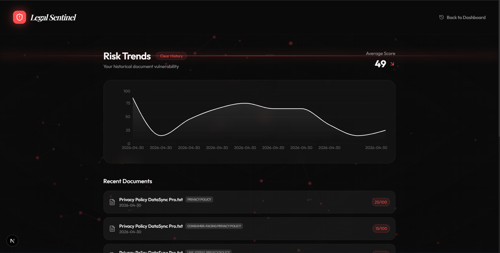

# 🛡️ Legal Sentinel

**Universal Legal Intelligence & High-Fidelity Analysis Platform**

Legal Sentinel is a document-agnostic legal analysis engine designed to protect freelancers, small businesses, and individuals from hidden risks in legal instruments. From NDAs and Wills to complex Service Agreements, Legal Sentinel provides high-precision audits, structural risk heatmaps, and proactive "Sentry Peek" browser integration.



## 🚀 Key Features

### ⚖️ Universal Analysis Engine
A document-agnostic architecture that identifies the legal instrument type and extracts document-specific "Key Pillars" (e.g., Liability, Intellectual Property, Termination) without hardcoded templates.

### 🔍 Structural Audit Heatmap
A visual representation of document health, identifying "Safe," "Caution," and "Danger" zones in the legal structure.

### ⚖️ Power Balance Visualization
An interactive tilting scale that weighs rights and obligations between parties to determine who truly holds the leverage in a contract.

### 🛡️ Sentry Peek (Browser Extension)
A proactive Chrome extension that auto-detects legal links (Terms of Service, Privacy Policies) on any website and injects a **🛡️ Sentinel Badge** for one-click instant audits.

### ✍️ Intelligent Redlining
AI-driven suggestions for professional-grade redlines, allowing users to see exactly what to strike through and what to add for better protection.

## 🛠️ Technology Stack

- **Frontend**: Next.js 16.2.6, Tailwind CSS, Framer Motion
- **Intelligence**: OpenRouter AI (LLM Agnostic), Vercel AI SDK
- **Parsing**: `unpdf` (Optimized serverless PDF extraction)
- **Extension**: Chrome Manifest V3, Content Script Injection, Background Service Workers

## 📦 Installation & Setup

1. **Clone the repository**
   ```bash
   git clone https://github.com/yourusername/legal-sentinel.git
   cd legal-sentinel
   ```

2. **Install dependencies**
   ```bash
   npm install
   ```

3. **Configure Environment Variables**
   Create a `.env.local` file:
   ```env
   OPENROUTER_API_KEY=your_api_key_here
   ```

4. **Run Development Server**
   ```bash
   npm run dev
   ```

5. **Load the Extension**
   - Open Chrome and navigate to `chrome://extensions/`
   - Enable "Developer Mode"
   - Click "Load Unpacked" and select the `extension` folder in this repository.

## 🛡️ Security & Privacy
Legal Sentinel is designed with privacy in mind. Document text is processed temporarily for analysis and is never stored on a remote database. History is persisted locally in the user's browser via `localStorage`.

---

Built for the **Legal and Non Legal Minds**. Protect your future, one document at a time.
